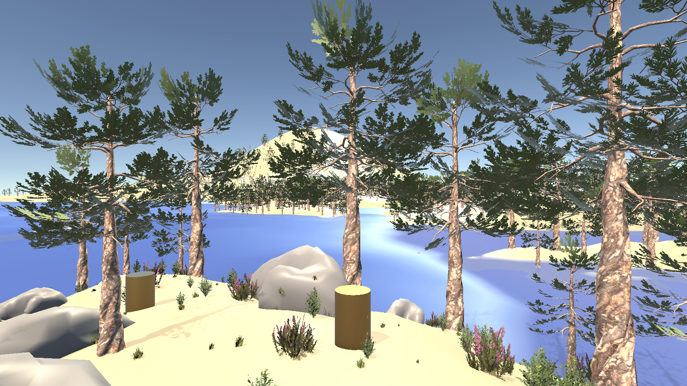

# 3D Cartographer's Quest Scene

This project features a 3D environment created in Unity from real-world scans of Crater Lake's Wizard island from 2010.

## Setup Instructions

1. Clone the repository containing this project.
2. Unzip the compressed `Project.zip` file.
3. Open the 3D environment in your preferred Unity.
4. Hit Play and find all the gold cylinders!

---
